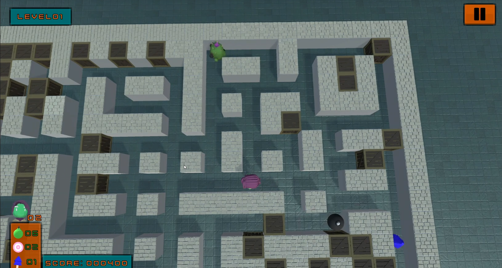

# Bomberman 3D - Unity Game

## 🎮 Project Description
Bomberman 3D is a classic action game developed in Unity Engine using C#.  
The game combines tactical combat, bomb placement, and explosion avoidance in a 3D environment.  
This project was created as a seminar work and demonstrates game development skills.

## 📂 Project Structure
- `Assets/` - contains all 3D models, textures, materials, scripts, and game scenes  
- `Packages/` - Unity packages and dependencies  
- `ProjectSettings/` - Unity project configuration files  

## 🚀 How to Run
1. Open the project in Unity Editor (recommended Unity version 2020.3 or newer).  
2. Open the scene `Assets/Scenes/Level1`.  
3. Press **Play** in the Unity Editor to start the game.  
4. Use keyboard and mouse to control the player character (add control details here if needed).

## 📋 Key Features
- Bomb placement and explosion mechanics  
- Player movement through a 3D level with obstacles  
- Explosion logic and destructible environment  

## 🛠️ Technologies and Tools
- Unity Engine (version 2020.3+)  
- C# scripting  
- 3D models in .fbx format  

## 📸 Screenshot 

## 🤝 Contact
If you have any questions or want to contribute to the project, feel free to contact me.

---

**Thank you for checking out the project!**
